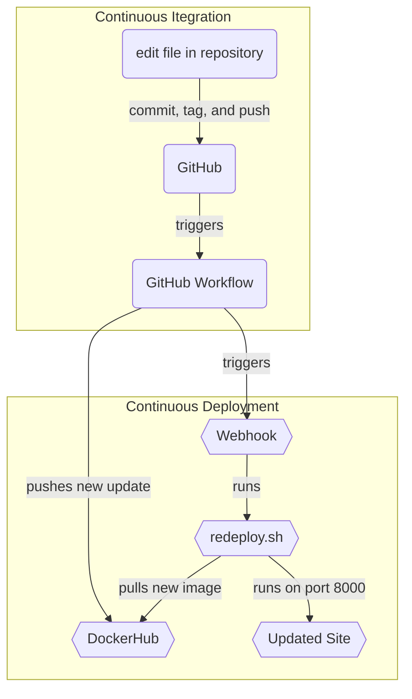

# Project 5

## Part 1 - Semantic Versioning

### Overview
We are using continuous deployment in this project to automatically pull and run images once an update is pushed.


This flowchart shows the steps of continuous integration and continuous deployment. First, we edit the repository, then commit, tag and push the new update. Once the update has been pushed to GitHub, the GitHub workflow will automatically push the new update to DockerHub; this is the continuous integration part. Next, the completion of the workflow will trigger the Webhook to run. The Webhook is responsible for running a script that will stop any current image and remove it. It will then pull the new image that was pushed to DockerHub from the workflow and run it automatically. 

### Generating Tags
To generate a tag:
* First, use `git commit` to commit an update to GitHub
* Next, use the command `git tag -a v*.*.*` , where the  `*`'s can be any number, which will tag that commit
* Then push the tag with `git push origin v*.*.*`

Since the GitHub workflow only builds and pushes an image when something is pushed to the `main` branch, we need to add to the workflow indicating that the image should be updated when pushing a `tag`. I was able to do this and now I get three new images pushed to Dockerhub:
* a __LATEST__ version 
* a __MAJOR.MINOR__ version (like v1.2) 
* and a __MAJOR__ version (like v1).

Here is my [DockerHub Repository](https://hub.docker.com/repository/docker/tyleriireland/project4/general)

## Part 2 - Deployment

### Installing Docker
To install docker on the ubuntu instance I used the command:  
* ```sudo apt-get install docker-ce docker-ce-cli containerd.io docker-buildx-plugin docker-compose-plugin```  
  
found on the official [dockerhub](https://docs.docker.com/engine/install/ubuntu/) website

### Container Restart Script
My container restart script will stop and remove any current version of the container that may be running and then pulls the new, updated image and runs that new image. Being able to automatically reload and run a new image is what creates continuous deployment. 
  
My script is in my `/home/ubuntu/` directory

### Webhooks
To install adnanh's webhook on the instance, I used the command:
* ```sudo apt-get install webhook```

Since out instance's reboot I made sure to have the `webhook` service start up on boot with the command `sudo systemctl enable webhook`

Once enabled, the task definition file, `webhook.conf`, is required for the service to properly startup. This defines what the webhook will do (ie. run a script) and is located in the `/etc` folder.

Configuring the webhook on GitHub is pretty simple. Under settings, there is a webhook tab, which is where you set up the webhook. For the URL I used  `http://54.158.236.40:9000/hooks/redeploy-webhook` and the trigger was `Workflow Run`


