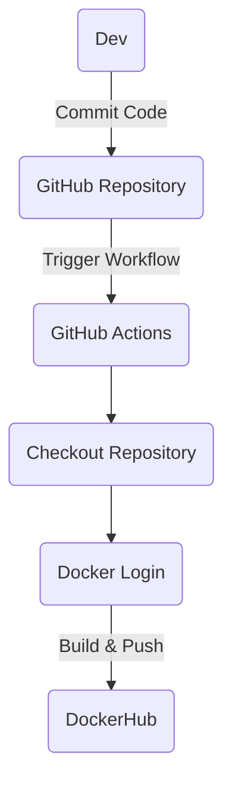

# Project 4

## Part 1 - Dockerize it

### Overview
The objective of this project is to create a container that will run a website with apache2. Containers contain libraries and files required to run a single service or software. They are similar to a virtual machine, but are much more lightweight and efficient. They can also be deployed are many machines.

### Diagram

  
### Run Project Locally
1. When installing Docker for Windows, WSL2 is recommended and should be installed prior to installing Docker. Having it installed before will make the installation smoother. I already had WSL2 installed prior to this project. I installed both through their website and it was pretty simple.
  
2. Building an image from a Dockerfile requires 3 things:  
  *  ` FROM httpd:2.4 `  
     * specifies the image that the container is being built from. 
  *  ` COPY website/ /usr/local/apache2/htdocs/ ` 
     * copies the contents from `website/` (my website) to `/usr/local/apache2/htdocs` (location where apache2 runs index.html).
  * `EXPOSE 80` 
     * tells the container which port to listen on.
     
  Once I finished the dockerfile, I used the command ` sudo docker build -t="apacheserver" . `
  * the `-t` flag represents the tag, or name, that I give the container. In this case, the container's name is apacherserver.
  * the `.` is the location of the dockerfile that the container will be built from.
     
 3. After building the image, the command `sudo docker run -d -p 5000:80 apacheserver` will run the container.
  * the `-d` flag runs the process in the background.
  * the `-p 5000:80` is the port binding flag.
    * I had to bind port 5000 because apache was running it's website on port 80 even though I don't have apache installed on my local system.

 4. To view the project running in the container, I put `localhost:5000` into the search bar.
 
 
     
 
 
 ## Part 2 - GitHub Actions & DockerHub
 
 1. To create a repository in DockerHub, I
   * registered a free account
   * hit the 'repositories' tab at the top
   * selected 'create repository' at the top right
   * gave it a name
   * kept it public
   * hit 'create'

2. After creating an account and repository, I 
  * used the command `docker login` to authenticate my account through the CLI
  * entered my username when prompted
  * entered my token when prompted for the password.
    * I recommend using a token in place of the password becuase it protects the account if the computer is compromised, and while using an access token, you cannot perform any admin controls, such as changing the password. This makes this connection much more secure.
    
3. To push a container image to Dockerhub, I used the command `docker image push`

4. To create a secret, I
  * went into the repository settings
  * selected `secrets and variables`
  * selected `actions`
  * created two secrets with the `new repository secret` button
  * named them `DOCKERHUB-USERNAME` and `DOCKERHUB_TOKEN`
  * gave them their secret value accordingly
    * These were the two secrets that were set for this project. We used these to log in to Dockerhub through the workflow 

5. When a push event occurs, the GitHub workflow is triggered, which builds a Docker image and pushed it to Dockerhub. Some variables in the workflow that are custom to my project are my GitHub secrets, which provides my username and token to login to Dockerhub.

